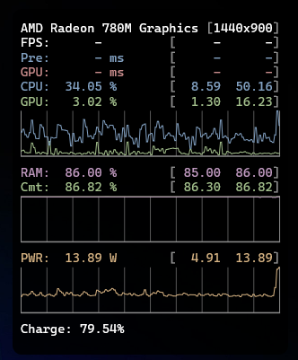

<div align="center">


# Kestrel

**Battery, system and frame-time overlay for Windows.**

One portable executable that shows what your machine is actually doing: battery
health, CPU and GPU load, package power, and real per-application frame timing,
in an always-on-top overlay you can keep open while you play.

[](https://github.com/semiloker/Kestrel/actions/workflows/ci.yml)
[](https://github.com/semiloker/Kestrel/releases/latest)
[](LICENSE)

<br>



<sub>The overlay, showing metrics grouped by unit with an independently scaled
graph per group. Frame rows read as dashes here because this capture was taken
without administrator rights.</sub>

</div>

---

## Why Kestrel

Most Windows monitoring tools fall into one of two camps. Either they are heavy
suites that install a kernel driver and a background service, or they are simple
gadgets that only show what `GlobalMemoryStatusEx` hands them.

Kestrel sits between the two on purpose:

- **No kernel driver, no installer, no service.** A single portable executable.
  CPU package power is read through the Windows Energy Meter counter set rather
  than a ring-0 MSR driver.
- **Real frame timing, not an estimate.** Frame rate, frame interval and
  per-frame GPU time come from ETW, the same event stream Intel PresentMon uses,
  attributed to the process that is actually rendering.
- **Honest about missing data.** When a value cannot be measured, Kestrel shows a
  dash. It never prints a plausible-looking zero in place of a number it does not
  have, and it writes the reason to a log you can read.
- **Small footprint.** The overlay redraw rate is yours to pick, and performance
  counters are sampled on a background thread so neither the window nor the
  overlay ever waits on them.
- **Built for laptops.** Kestrel is the only one of these tools that knows what
  a frame costs you: frames per watt, and a warning when your charger cannot
  keep up with the load.

### What Kestrel deliberately will not do

RTSS and MSI Afterburner hook into the game's own present chain to draw inside
it and to cap the frame rate. That means injecting a DLL into the game process.
Kestrel does not do this, and will not:

- anti-cheat systems treat injection as an attack, and users get banned for it
- it contradicts the whole point of a portable executable with no installer

The cost of that choice is honest: **there is no frame limiter, and the overlay
cannot draw over exclusive-fullscreen games.** Most modern titles run borderless
or flip-model, where the overlay works fine. If you need a frame cap, use RTSS
alongside Kestrel.

---

## Features

### Overlay

- Per-pixel alpha overlay drawn with Direct2D and DirectWrite, styled after the
  Apple Metal Performance HUD
- Stays above composited fullscreen and borderless windowed games
- Any of the four screen corners, adjustable margin
- Rolling graphs holding 24 seconds of history, grouped by unit so milliseconds,
  percentages, memory and watts each get an independently scaled plot
- Per-metric visibility and per-metric graph toggles
- Redraw rate of 50, 100, 250 or 500 ms
- Global hotkeys: `Ctrl+Alt+H` to show and hide, `Ctrl+Alt+1/2/3` to switch
  preset, `Ctrl+Alt+B` to start and stop a recording

### Frame timing

- Frames per second and frame interval in milliseconds
- **1% low and 0.1% low computed from individual frame intervals**, not from
  averaged samples. `1% low = 1000 / P99(frame time)`, the same definition
  MangoHud and CapFrameX use, so the numbers are comparable between tools.
  Each figure stays a dash until enough frames exist to mean anything: 100
  frames for the 1% low, 1000 for the 0.1%
- **CPU or GPU bound**, from per-frame GPU time against frame interval
- Real per-frame GPU time, measured from the graphics kernel scheduler rather
  than derived from a utilisation percentage
- Graphics API detection: D3D9, D3D11, D3D12, OpenGL, Vulkan
- Automatically follows the process that is presenting frames, so the reading
  survives alt-tabbing out of the game

### System

- CPU total and per-core utilisation
- CPU package power in watts, read from hardware RAPL counters
- **Frames per watt**, the number that tells you whether raising the power limit
  actually bought you anything
- GPU utilisation and per-process GPU time
- **Video memory in use against the adapter's capacity**
- Physical memory and commit charge
- Display resolution, render scale, refresh rate and composition state

### Battery

- Charge level, voltage, current rate and remaining capacity
- Estimated time to empty and time to full
- Charge cycle count and wear against the design capacity
- Designed and full-charge capacity, chemistry, manufacturer
- **Charger deficit warning** — plugged in and still draining, because the load
  exceeds what the power supply delivers

### Recording a run

- `Ctrl+Alt+B` starts and stops a capture, with a `REC` row in the overlay so
  you always know it is running. The overlay does not have to be visible
- Summary per run: average, 1% low, 0.1% low, median and worst frame, stutter
  count, average package power, **energy spent in watt-hours**, and the battery
  life that load implies
- One CSV row per frame in `%APPDATA%\Kestrel\captures\`, plus an `index.csv`
  of every run, both readable by Excel or a script

### Updating

- Checks GitHub for a newer release only when you ask it to, never on its own
- Installs in place and keeps the previous build as `kestrel.old.exe`, with a
  roll-back button if the new one misbehaves

### Application

- Settings persisted to `%APPDATA%\Kestrel\settings.ini`
- Diagnostic log at `%APPDATA%\Kestrel\kestrel.log`
- Start with Windows, optionally elevated through a scheduled task so that no UAC
  prompt appears on every login
- Per-monitor DPI aware
- Light and dark themes with a selectable accent colour
- Minimise to tray

---

## Requirements

- Windows 10 version 1607 or newer, 64-bit
- Administrator rights **only** for frame-timing metrics. Everything else works
  as a normal user.

---

## Installation

Download `kestrel.exe` from the [latest release](https://github.com/semiloker/Kestrel/releases/latest)
and run it. There is no installer, and nothing is written outside
`%APPDATA%\Kestrel`.

---

## Usage

### Showing the overlay

Open the Settings tab and enable the on-screen display, or press `Ctrl+Alt+H` at
any time, including from inside a game.

### Enabling frame metrics

Real-time ETW tracing requires administrator rights. Without them the frame rows
show dashes and the log explains why.

Open Settings and turn on **Run as administrator**. This registers a Windows
scheduled task that starts Kestrel at logon with elevated rights. You will see one
UAC prompt when the task is created and none afterwards, including when you start
Kestrel manually, because it relaunches itself through that task.

### Configuration

Everything is toggled from the Settings and Appearance tabs. The resulting
`%APPDATA%\Kestrel\settings.ini` is plain `key=value` text and can be edited by
hand while Kestrel is closed. Deleting the file resets everything.

Three keys have no user interface, because they exist for diagnosing games whose
present events Kestrel does not recognise yet:

| Key | Meaning |
| --- | --- |
| `etw.fallbackProvider` | Provider index: `0` DXGI, `1` D3D9, `2` DxgKrnl |
| `etw.fallbackEventId` | Event ID within that provider to treat as a presented frame |
| `etw.deepCensus` | `1` enables an unfiltered DxgKrnl event census. Expensive, diagnostics only |

---

## Troubleshooting

Kestrel writes a diagnostic log to `%APPDATA%\Kestrel\kestrel.log`, truncated on
every start. It is the first place to look.

**No frame rate, frame interval or GPU milliseconds.** The log will say
`etw: not elevated`. Enable **Run as administrator** in Settings.

**Frame metrics work in some games but not others.** Kestrel recognises the
common present events of DXGI, D3D9 and the DirectX graphics kernel. If a game
uses a path outside that list, Kestrel runs an event census and writes a table:

```
etw census for pid 8108 (game.exe) over 8.0s:
  provider=0 (DXGI    ) id=178   count=470     rate=58.7/s
  provider=0 (DXGI    ) id=186   count=990     rate=123.6/s
```

Find the row whose rate matches the frame rate the game reports, then put its
provider and ID into `settings.ini` as `etw.fallbackProvider` and
`etw.fallbackEventId`. Ignore rows at a multiple of your frame rate. Please also
open an issue with the table so the ID can be recognised for everyone.

**The overlay is invisible in a game.** Kestrel draws into a layered window, which
the desktop compositor places above composited and borderless windowed games. A
game in true exclusive fullscreen bypasses the compositor entirely and cannot be
overlaid without injecting code into its process, which Kestrel does not do.
Switch the game to borderless windowed mode.

**CPU package power shows a dash.** The machine does not expose a package rail
through the Windows Energy Meter counter set. The log lists the instances that
were found.

---

## Building from source

### Prerequisites

- MSYS2 with the MinGW-w64 toolchain, or any GCC 13 or newer targeting
  `x86_64-w64-mingw32`
- GNU Make
- Python 3 with Pillow, only to regenerate the icon

```bash
pacman -S mingw-w64-x86_64-gcc mingw-w64-x86_64-make
```

### Build

```bash
git clone https://github.com/semiloker/Kestrel.git
cd Kestrel
mingw32-make
```

The result is `bin/kestrel.exe`, statically linked so it runs without MinGW
runtime DLLs beside it.

```bash
mingw32-make clean
```

Header dependencies are tracked, so editing a header rebuilds everything that
includes it. A plain `mingw32-make` after any change is always correct.

### Regenerating the logo

The icon is generated from code so that it stays reproducible:

```bash
python tools/make_logo.py assets
```

This writes `assets/kestrel.ico` containing every size from 16 to 256 pixels,
plus the PNG and SVG variants used by this document.

### Project layout

| Path | Contents |
| --- | --- |
| `src/`, `include/` | Application source |
| `assets/` | Logo and icon, generated by `tools/make_logo.py` |
| `tools/` | Helper scripts |
| `app.rc`, `app.manifest` | Icon, version block, DPI awareness declaration |
| `.github/workflows/` | Continuous integration and release automation |

Key modules:

| File | Responsibility |
| --- | --- |
| `etw_bi.*` | ETW session, present-event tracking, per-process frame timing |
| `overlay_bi.*` | Layered-window overlay and Direct2D rendering |
| `hud_bi.*` | Overlay data model, series history, layout |
| `resource_usage_bi.*` | Shared PDH query for CPU, GPU, power and memory |
| `autostart_bi.*` | Registry and Task Scheduler autostart |
| `settings_bi.*` | INI persistence |

---

## Roadmap

Ordered roughly by priority. Suggestions are welcome, open an issue.

- **Benchmark capture.** Record a run to CSV with frame times, percentiles and a
  summary, for comparing settings or hardware.
- **Per-game profiles.** Remember which metrics to show for each executable.
- **Exclusive fullscreen support.** Requires an injected overlay, the approach
  RivaTuner Statistics Server takes.
- **Wider frame-source coverage.** Recognise more present events so that OpenGL
  and Vulkan titles work without manual configuration.
- **Multi-GPU awareness.** Report each adapter separately instead of summing.
- **Temperature and fan readings** where the platform exposes them without a
  driver.
- **Packaging.** A winget manifest and a signed release binary.
- **Localisation.** The interface is English only today.

---

## Contributing

Bug reports and feature requests belong in
[GitHub Issues](https://github.com/semiloker/Kestrel/issues).

A useful bug report contains:

1. Windows version, CPU and GPU model
2. What you expected and what happened instead
3. The contents of `%APPDATA%\Kestrel\kestrel.log` from the run that showed the
   problem
4. For overlay problems, the game and whether it runs fullscreen, borderless or
   windowed

The log is the single most useful thing to attach. It records why a metric was
unavailable, which process is being measured and which event source supplies the
frame timing.

Pull requests are welcome. Please match the existing style: the codebase carries
no comments, headers are included as `#include "name.h"` with no relative paths,
and the build must stay warning-free under `-Wall`.

---

## License

[MIT](LICENSE)
